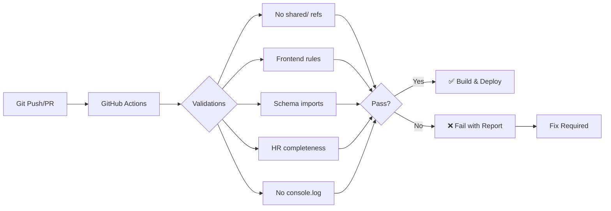

# W3 Suite CI/CD Controls & Code Quality Enforcement

## Overview
This document describes the automated code quality controls implemented in the W3 Suite project to ensure consistent code patterns and prevent common violations.

## Automated Validations

### 1. GitHub Actions Workflow
Location: `.github/workflows/code-quality.yml`

Runs automatically on:
- Every push to main, develop, feature/*, release/* branches
- Every pull request to main or develop

### 2. Pre-commit Hooks
Location: `.husky/pre-commit`

Runs locally before every commit to catch issues early.

## Validation Scripts

All validation scripts are located in the `scripts/` directory:

### 1. `validate-no-shared-refs.js`
**Purpose**: Prevents references to non-existent `shared/` folder

**What it checks**:
- ❌ `import ... from 'shared/schema'`
- ❌ `from '@shared/...'`
- ❌ `require('shared/...')`

**How to fix violations**:
```javascript
// ❌ WRONG
import { User } from 'shared/schema';
import { User } from '@shared/schema';

// ✅ CORRECT
// Backend files:
import { users } from '@/db/schema/w3suite';

// Frontend files:
import type { User } from 'apps/backend/api/src/db/schema/w3suite';
```

### 2. `validate-frontend-rules.js`
**Purpose**: Ensures frontend consistency and best practices

**What it checks**:
1. **Inline Colors**: No hardcoded hex colors or RGB values
2. **Layout Usage**: All pages must use the Layout component
3. **Component Usage**: Prefer shadcn/ui over custom components
4. **Frontend-kit Usage**: Suggests using templates where applicable

**How to fix violations**:

#### Inline Colors
```jsx
// ❌ WRONG
<div style={{ color: '#FF6900' }}>Text</div>
<div style={{ backgroundColor: 'rgb(123, 44, 191)' }}>Box</div>

// ✅ CORRECT
<div className="text-primary">Text</div>
<div style={{ color: 'var(--primary)' }}>Text</div>
```

#### Layout Usage
```jsx
// ❌ WRONG - Page without Layout
export default function MyPage() {
  return <div>Content</div>;
}

// ✅ CORRECT
import Layout from '@/components/Layout';

export default function MyPage() {
  return (
    <Layout>
      <div>Content</div>
    </Layout>
  );
}
```

### 3. `validate-schema-imports.js`
**Purpose**: Ensures correct schema import paths

**What it checks**:
- Schema imports must use correct project paths
- No direct imports of `schema.ts`
- Consistent import patterns across the codebase

**How to fix violations**:
```javascript
// ❌ WRONG
import { users } from '../db/schema/w3suite';
import * as schema from './schema';

// ✅ CORRECT - Backend
import { users, tenants } from '@/db/schema/w3suite';
import { brands, channels } from '@/db/schema/public';

// ✅ CORRECT - Frontend
import type { User, Tenant } from 'apps/backend/api/src/db/schema/w3suite';
```

### 4. `validate-hr-system.js`
**Purpose**: Validates HR system completeness

**What it checks**:
- All required HR tables exist in schema
- All HR API endpoints are implemented
- Frontend pages match backend capabilities
- Required hooks and storage methods exist

**Required HR Components**:
- 15 HR tables in w3suite schema
- 9 HR API endpoints
- 9 HR frontend pages
- Supporting hooks and services

### 5. `validate-no-console.js`
**Purpose**: Detects console statements in production code

**What it checks**:
- `console.log()`, `console.error()`, etc.
- Excludes test files and scripts

**How to fix**:
- Remove console statements
- Use proper logging service (Winston for backend)
- Use debug library for development logging

## Running Validations

### Run All Validations
```bash
npm run validate
# or
node scripts/run-all-validations.js
```

### Run Individual Validations
```bash
# Check for shared/ references
node scripts/validate-no-shared-refs.js

# Check frontend rules
node scripts/validate-frontend-rules.js

# Check schema imports
node scripts/validate-schema-imports.js

# Check HR system
node scripts/validate-hr-system.js

# Check for console statements
node scripts/validate-no-console.js
```

## Setting Up Husky (First Time)
```bash
node scripts/setup-husky.js
```

This will:
1. Install Husky as a dev dependency
2. Initialize git hooks
3. Create pre-commit hook
4. Add validation scripts to package.json

## Bypassing Validations (Emergency Only)
```bash
# Skip pre-commit hooks
git commit --no-verify -m "Emergency fix"
```

⚠️ **Warning**: Only bypass validations in emergency situations. All code must pass validations before merging to main branch.

## Common Violations and Solutions

### Violation: Inline Colors
**Current violations found**: 30+ instances in workspace components

**Solution**:
1. Define colors in CSS variables in `index.css`:
```css
:root {
  --brand-orange: hsl(24, 100%, 50%);
  --brand-purple: hsl(275, 60%, 47%);
  --success: hsl(142, 71%, 45%);
  --warning: hsl(38, 92%, 50%);
}
```

2. Use Tailwind classes or CSS variables:
```jsx
// Use Tailwind
<Shield className="w-5 h-5 mr-2 text-orange-500" />

// Or CSS variables
<Shield className="w-5 h-5 mr-2" style={{ color: 'var(--brand-orange)' }} />
```

### Violation: Schema Import Paths
**Current violations found**: 14 instances in backend files

**Solution**:
Update all schema imports to use the alias:
```javascript
// In backend files, use @/ alias
import { users, tenants } from '@/db/schema/w3suite';
```

### Violation: Missing Layout Component
**Current violations found**: Multiple pages in both web apps

**Solution**:
Ensure all pages are wrapped with Layout:
```jsx
import Layout from '@/components/Layout';

export default function Page() {
  return (
    <Layout>
      {/* Page content */}
    </Layout>
  );
}
```

## CI/CD Pipeline Flow



## Best Practices

1. **Run validations locally** before pushing:
   ```bash
   npm run validate
   ```

2. **Fix violations immediately** when detected

3. **Update validation rules** as the project evolves

4. **Document exceptions** if any rule needs to be bypassed

5. **Review validation reports** in pull requests

## Troubleshooting

### Issue: Scripts fail with "require is not defined"
**Solution**: Ensure all scripts use ES module syntax (`import` instead of `require`)

### Issue: Husky hooks not running
**Solution**: 
```bash
# Reinstall husky
npx husky install
# Make hooks executable
chmod +x .husky/pre-commit
```

### Issue: False positives in validation
**Solution**: Update the exclusion patterns in the respective validation script

## Future Enhancements

- [ ] Add performance budget checks
- [ ] Implement accessibility validation
- [ ] Add security vulnerability scanning
- [ ] Implement code coverage requirements
- [ ] Add automated dependency updates
- [ ] Implement visual regression testing

## Support

For questions or issues with the CI/CD controls, please:
1. Check this documentation first
2. Review the validation script source code
3. Contact the DevOps team

---

Last Updated: September 2025
Version: 1.0.0